# Getting Started

There are two ways you can use VisualBox; as a dashboard builder or as an integration / widget developer. This guide will show how to get started with building a dashboard and how to add crowdsourced data integrations and widgets to visualize information.

## Create an Account

Before you can use VisualBox you need to create an account. Visit the [signup page](https://visualbox.io/auth/signup) to create an account if you haven't already done so.

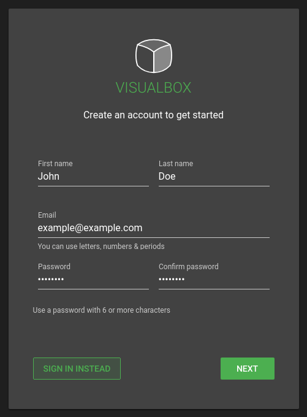

A confirmation email will be sent with a link that you must follow to verify your email. You will then be able to [login to the dashboard builder](https://visualbox.io/auth/signin).

## Create a New Dashboard

Once you login you will see a list of your dashboards. The list will be empty the first time you login, so let's create a new dashboard by clicking the **+** button at the top of the dashboard list.

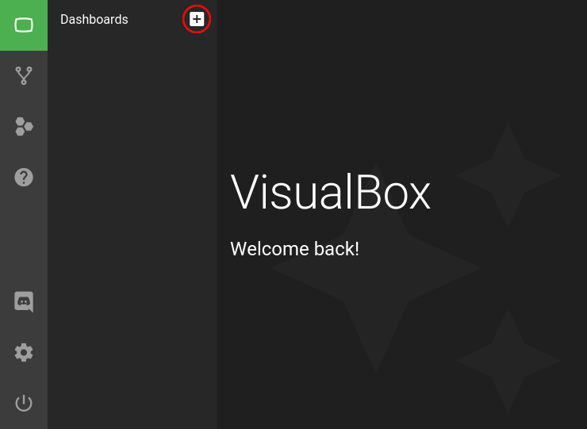

Give the dashboard a name and click **CREATE**. You can later change the name if you'd like.

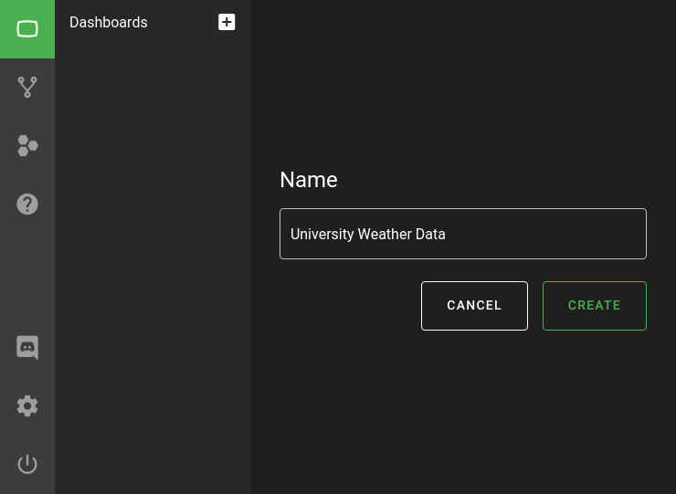

The dashboard will appear in the list of other dashboards. Click on it to open the dashboard builder.

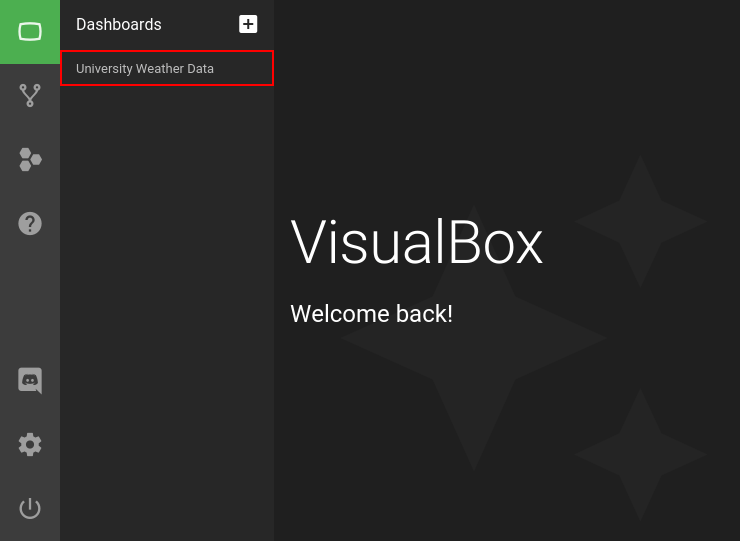

You will now see your new dashboard. It will initially be completely empty, so we need to add an integration (to fetch some data) and a widget (to display the data).

## Add Integration

When a dashboard is opened a panel to the left is shown with three buttons:

  1. Add integration
  2. Add widget
  3. Dashboard settings

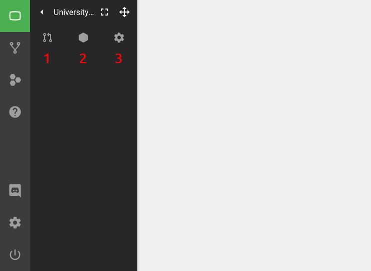

Click the first button to add an integration. An integration explorer will open where you can search through public, crowdsourced integrations. You can also find your own local integrations that are not public. For now we will use a public integration called **UiT - Today's Weather Data**. Find it and click on it.

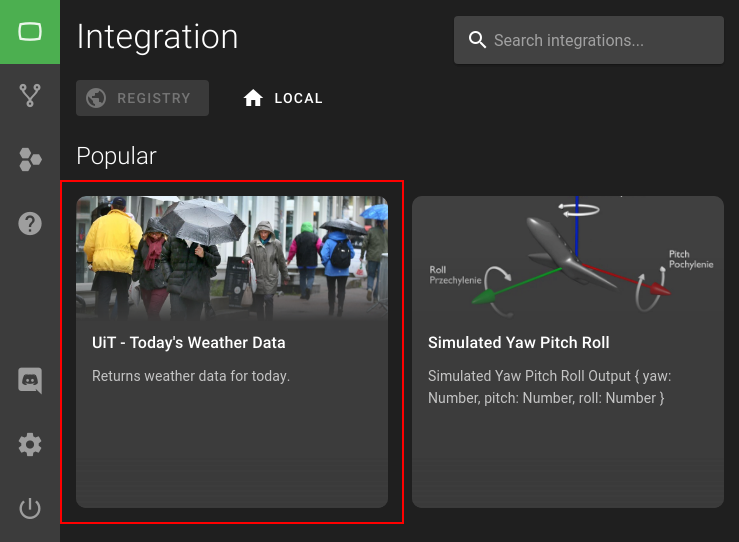

Select the latest version and click **ADD**. When using the latest version you are ensured to run the latest code whenever the integration is updated by the maintainer. If you choose a previous version you will stay locked on that version of the integration code, even if the maintainer makes an update.

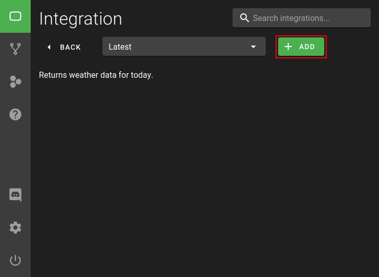

## Configure Integration

After an integration has been added to the dashboard it will appear in the left panel and go from a red color to a green color. Once it's green (meaning it has started) click on it to open the configuration menu.

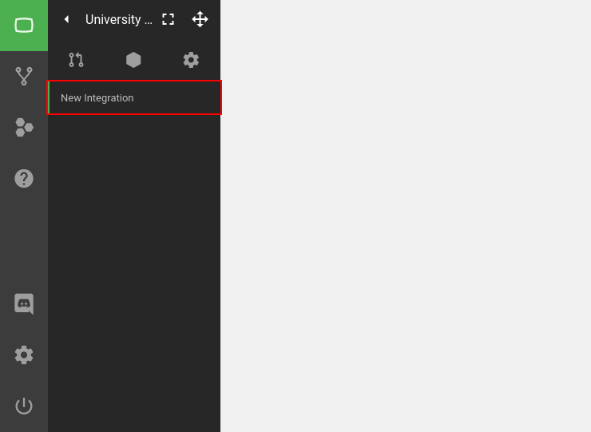

Change relevant information such as the name and update inteval. The configuration will change for different integrations. After all is done click **SAVE**. The integration will now restart.

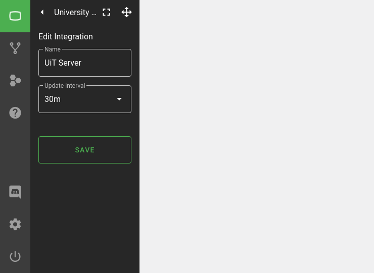

## Add Widget

To visualize the data produced by the integration you must now add a new widget by clicking the second button in the dashboard panel. A widget explorer will open where you can search through public widgets and your own local widgets. For now we will use a public widget called **Highcharts.js - Spline**. Find it and click on it.

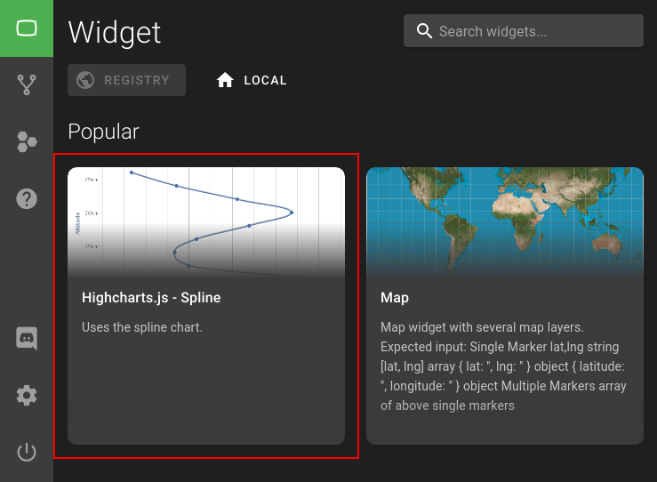

Similarly to when adding an integration we select the latest version to keep the widget code updated when the maintainer makes an update. Click **ADD** to add the widget to your dashboard:

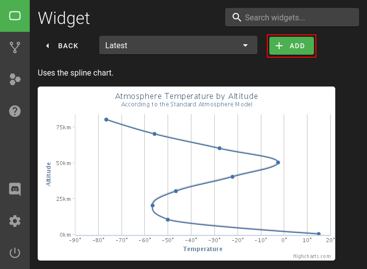

The widget has now appeared in the dashboard. If you hover the widget with your mouse you can see a drop-down menu in the upper right corner. Click on the pencil button to open the widget configuration panel.

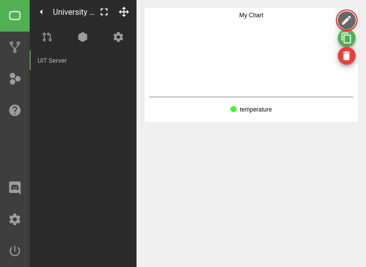

The configuration panel let's you change the look and feel and differs from widget to widget, but they all have the same top button called **Data Source**. Click this button to open the **data model explorer**.

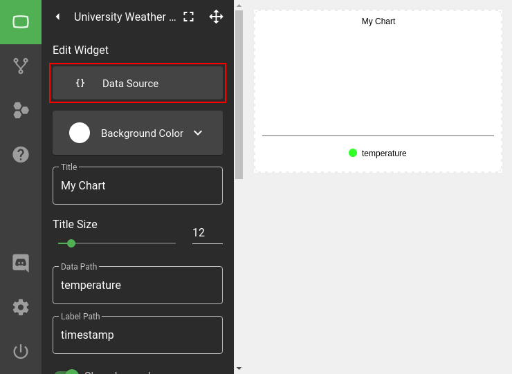

The **data model explorer** shows data produced by the integration we added earlier. The widget in question will only use the value it's provided. Select a node containing an array of data-points in the data-tree and click **SAVE** in the upper right corner.

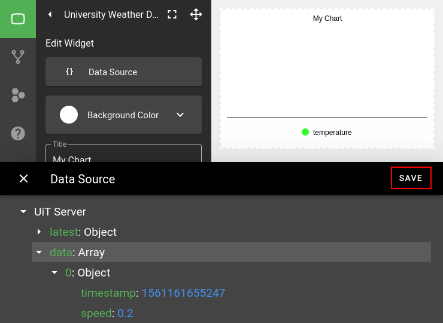

You can now see that the widget shows the value that we selected. You can change the font size and color, give it a title, move it around and resize it (by clicking the move button in the top right panel).

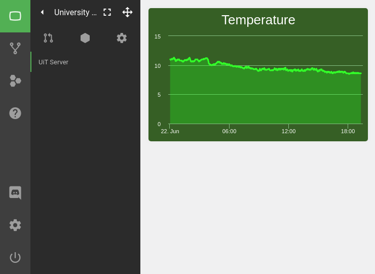

Experiment with different integration and widget combinations to create interesting and visually appealing dashboards. Once you get a hang of it you can move on to create your own integrations / widgets or fork the code of existing implementations.
